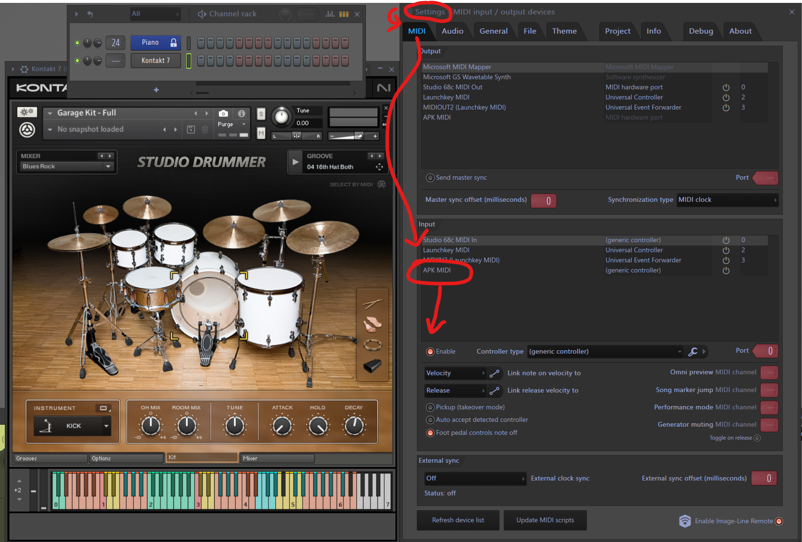

# Teensy Ekit Module

This project is an implementation of a MIDI USB trigger system. The system reads analog signals from sensors, processes them, and sends MIDI notes based on the signal's peak amplitude.  

For my system, the signals are first conditioned through several passive components to generate the signal read into the Teensy 4.1 analog pins.

## What the circuit looks like

The existing settings seem robust to some relatively janky conditions, including a free-hanging 35 mm piezo and a 6 ft 1/4" TS cable connected with alligator clips on the circuit side.  A Teensy pinout diagram image is included in the images folder as well.


## How my setup looks in FL Studio

This is using a PreSonus Studio 68c audio interface with a 256 sample buffer size.  Testing so far yields latencies difficult to detect (by my amateur ears).




## Dependencies

- [USBHost_t36.h]()

- [ADC.h]()
  
## Code Structure

### MidiTrigger Struct

The meat of the logic is in the MidiTrigger struct which contains fields for the various state variables for each sensor as well as the method to check and trigger the MIDI note:

```cpp
struct MidiTrigger {
  int analogPin;
  int midiNote;

  int peakValue = 0;
  bool noteActive = false;
  unsigned long lastStrikeTime = 0;

  enum channelState {ch_idle, ch_triggered};
  channelState state = ch_idle;

  void checkAndTrigger() {
    int sensorValue = adc->analogRead(analogPin);

    if (state == ch_idle) {
      if (sensorValue > (peakValue + detectionThreshold)) {
        state = ch_triggered;
        peakValue = sensorValue;
      } else if (sensorValue <= (peakValue - detectionThreshold)) {
        peakValue = sensorValue;
      }
    }

    if (state == ch_triggered) {
      if (sensorValue > peakValue) {
        peakValue = sensorValue;  // Update peak value
      } else if (sensorValue <= (peakValue - detectionThreshold)) {
        // Signal has settled; trigger the MIDI note
        float velocity = map(peakValue, 1, 1024, 30, 127);
        usbMIDI.sendNoteOn(midiNote, velocity, 1);
        usbMIDI.sendNoteOff(midiNote, 0, 1);
        noteActive = false;
        state = ch_idle;           // Reset to idle state
        peakValue = sensorValue;   // Trail the peak lower now that it has settled
      }
    }
  }
};
```

### MidiTrigger Array

And then the sensors are simply looped over to call the checkAndTrigger method for each:

```cpp
const byte numTriggers = 4;
MidiTrigger triggers[] = {
  {A0, 60},
  {A1, 61},
  {A2, 62},
  {A8, 63},
};

void loop() {
  for (int i = 0; i < numTriggers; i++) {
    triggers[i].checkAndTrigger();
  }
}
```

## Usage

1. Upload the code to your microcontroller.
2. Connect the sensors to the specified analog pins.
3. Open the serial monitor to view the output.
4. The system will read the sensor values and send MIDI notes based on the detected peaks.

REMEMBER to adjust the length of the trigger array if you have more or fewer sensors.  Is this how C++ programmers really live?

Modify the name.c file in this repository to change the name of the MIDI device in your DAW

## To-do

- [x] implement a more robust peak detection algorithm that monitors the trend in the signal rise and decay
- [x] scale up sensors allowable sensors
- [x] get latency difficult to detect
- [ ] implement logic for foot pedal CC for the Lemon hi-hat compatible with Kontact Studio Drummer [IN PROGRESS]
- [ ] implement rimshot piezos (may need special logic to reject a batterhead detection when it's simultaneous with a rimshot detection though current logic has been sufficient for the Alesis heads to reject batterhead sensing on a rimshot strike)
- [ ] add digital QoL like MIDI note selection hot swap and sensitivity adjustment building towards a high end Roland-esque UI
- [ ] extend to triggering local samples on an SD card and pair with i2s audio output
- [ ] rethink the serial writes to graph independent oscilloscope views for the signals to dial in sensitivities with the trim pots
- [ ] test with a cheap Arduino with serial support like the Nano (~3/$20) to see if this could be made more affordable

## Resources

- [Gadget Reboot Youtube Video](https://youtu.be/y2Lmbts9IIs) - initial codebase for i2s implementation, circuit design for signal conditioning
  
- [Evan Kale MIDI Drums Github](https://github.com/evankale/ArduinoMidiDrums) - Rockband kit midi hijacking ideas

- [Teensy 4.1 Pinout Diagram](https://www.pjrc.com/teensy/pinout.html) - for reference

## License

This project is licensed under the MIT License
