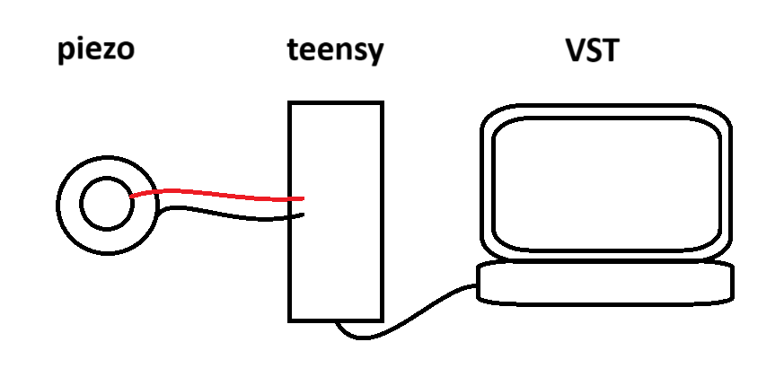

# Teensy Ekit Module

This project is an implementation of a MIDI USB trigger system. The system reads analog signals from sensors, processes them, and sends MIDI notes based on the signal's peak amplitude.  

For my system, the signals are first conditioned through several passive components to generate the signal read into the Teensy 4.1 analog pins.

## Evolution of the circuit

Unconditioned signal was very prone to false triggers.



With signal conditioning (from [Gadget Reboot](https://youtu.be/y2Lmbts9IIs)), initial settings became robust to some relatively janky conditions, including a free-hanging 35 mm piezo and a 6 ft 1/4" TS cable connected with alligator clips.


A support structure for 1/4" TRS ports allowed interfacing with proper ekit elements with more stability, as well as the addition of other elements like the 10k knob potentiometer.  While many of the drum elements will ultimately transport at least two signals (batter head + rimshot or edge + bell, for example), the current system is only set up to handle the batter head signal—hence the dangling yellow wires which connect to the vestigial ring of the TRS port.


Using the variable resistor in the Roland-esque hi-hat foot controller with a voltage divider allows communicating its plunger position as an analog signal mapped to MIDI CC#4 which controls the hi-hat closedness parameter in Kontakt Studio Drummer.


## Interfacing with the VST/DAW

The microcontroller sends USB MIDI and is recognized by software as "APK MIDI" (configured using the name.c file).  To minimize latency, I'm using a PreSonus Studio 68c audio interface with a sample buffer size at or below 256.  Testing the basic strikes yields latencies difficult to detect to my ears.


  
## Code Structure

### Dependencies

- USBHost_t36.h

- ADC.h

### MidiTrigger Structs

The meat of the logic is in the trigger (MidiTrigger) and CC (ccControl) structs which contain fields for the state of each sensor as well as the methods to check and trigger the relevant MIDI:

```cpp
struct MidiTrigger {
  int analogPin;
  int midiNote;

  void checkAndTrigger() {
    int sensorValue = adc->analogRead(analogPin);

    // Monitor the peak value of the signal for triggering
    if (state == ch_idle) {
      if (sensorValue > (peakValue + detectionThreshold)) {
        state = ch_triggered;
        peakValue = sensorValue;
      } else if (sensorValue <= (peakValue - detectionThreshold)) {
        peakValue = sensorValue;
      }
    }

    // Monitor the rising edge of a triggered signal
    if (state == ch_triggered) {
      if (sensorValue > peakValue) {
        // Update peak value
        peakValue = sensorValue;
      } else if (sensorValue <= (peakValue - detectionThreshold)) {
        // Signal has settled; trigger the MIDI note
        float velocity = map(peakValue, 1, 1024, 30, 127);
        usbMIDI.sendNoteOn(midiNote, velocity, 1);
        usbMIDI.sendNoteOff(midiNote, 0, 1);
        noteActive = false;
        // Reset to idle state
        state = ch_idle;
        // Trail the peak lower now that it has settled
        peakValue = sensorValue;
      }
    }
  }
};
```

```cpp
struct ccControl {
  int analogPin;
  int ccNumber;
  int lastValue = -1;  // Initialize with an invalid value to force the first send
  bool isPedalDown = false;

  void checkAndSend() {
    int sensorValue = adc->analogRead(analogPin);
    int ccValue = map(sensorValue, 840, 5, 0, 127);  // Map to MIDI CC range
    if (ccValue - lastValue > 2 || ccValue - lastValue < -2) {  // Only send if value has changed
      usbMIDI.sendControlChange(ccNumber, ccValue, 1);
      lastValue = ccValue;

      // Check if the pedal has moved to the near-closed position rapidly
      if (ccValue > 120 && !isPedalDown) {  // Adjust threshold as needed
        // int pedalVelocity = map(lastValue - ccValue, 0, 7, 60, 127);
        usbMIDI.sendNoteOn(44, 110, 1); 
        usbMIDI.sendNoteOff(44, 0, 1);
        isPedalDown = true;
        // Serial.print("Pedal Down");
      }

      if (isPedalDown && ccValue <= 120){
        isPedalDown = false;
      }
    }
  }
};
```

### MidiTrigger Array

And then the sensors arrays,

```cpp
const byte numTriggers = 8;
noteTrigger triggers[] = {
  {A0, 46},
  {A1, 61},
  {A2, 62},
  {A3, 63},
  {A4, 64},
  {A5, 65},
  {A6, 66},
  {A7, 67},
};

const byte numCCs = 1;
ccControl ccControls[] = {
  {A8, 4},
};

```

are simply looped over to call the checkAndTrigger method for each:

```cpp
void loop() {
  checkNotes();
  checkCC();
}

void checkNotes() {
  for (int i = 0; i < numTriggers; i++) {
    triggers[i].checkAndTrigger();
  }
}

void checkCC() {
  for (int i = 0; i < numCCs; i++) {
    ccControls[i].checkAndSend();
  }
```

## Usage

1. Upload the code to your microcontroller.
2. Connect the sensors to corresponding analog pins.
3. Enable the device in software

Debug with serial plotter to dial in the sensitivity of the sensors.

REMEMBER to adjust the length of the trigger array if you have more or fewer sensors.  Is this how C++ programmers really live?

Modify the name.c file in this repository to change the name of the MIDI device in your DAW

## To-do

- [x] implement a more robust peak detection algorithm that monitors the trend in the signal rise and decay
- [x] scale up sensors allowable sensors
- [x] get latency difficult to detect
- [ ] more debounce (currently upwards of 5 triggers for hard strikes)
- [ ] investigate loudness issues
  - [ ] try louder mappying (~59 max trigger value)
  - [ ] record values for soft/medium/hard hits across several controller to see if some are just less sensitive (knowing sensitivity variance will be necessary soon either way)
- [ ] polish continuosly variable hi-hat implementation
  - [x] send foot pedal CC for the Lemon hi-hat compatible with Kontact Studio Drummer's hat-closedness parameter (CC#4)
    - [ ] get to work in FL's Kontakt instance out of the box (got it by coordinating ports in FL MIDI IO settings and the Kontakt wrapper...but idk how to hard code default midi controller port number and it resets on each upload it seems)
  - [x] get hat to recognize a pedal press and send the note (assigned a threshold and `isPressed?` boolean)
  - [ ] implement velocity sensitivity (circle buffer that calculates maximum difference when the signal crosses the pedal press threshold and maps that to a velocity range?)
  - [ ] narrow the closeness range to get true closed hat sound
  - [ ] solve bug where hat triggers don't cut currently playing samples like they should (possibly Kontakt isn't equipped to deal with the repeat signals from poor debounce so solving that might solve this?)
- [ ] implement rimshot piezos (may need special logic to reject a batterhead detection when it's simultaneous with a rimshot detection though current logic has been sufficient for the Alesis heads to reject batterhead sensing on a rimshot strike)
- [ ] Build toward high-end Roland-esque UI
  - [x] wire knob pot
  - [ ] implement digital QoL like MIDI note selection hot swap and sensitivity adjustment
- [ ] extend to triggering local samples on an SD card and pair with i2s audio output
- [ ] dial in sensitivities with the trim pots
- [ ] test with a cheap controller with serial support and MIDI libraries (e.g., knock-off arduino micro ~3/$20) to see if this could be made more affordably

## Resources

### MIDI Percussion Note Numbers

- **36 - Kick**
- 37 - Snare Cross Stick
- **38 - Snare**
- 41 - Tom (floor 2)
- 42 - Hi-Hat (closed) (*sent through CC struct*)
- 45 - Tom (low)
- 43 - Tom (floor 1)
- 44 - Hi-Hat (pedal) (*sent through CC struct*)
- 45 - Tom (low)
- 46 - **Hi-Hat (open)**
- 47 - Tom (mid)
- 48 - Tom (high)
- 49 - **Crash**
- 51 - **Ride (edge)**
- 52 - China
- 53 - Ride (bell)
- 55 - Splash

### Links

- [Gadget Reboot Youtube Video](https://youtu.be/y2Lmbts9IIs) - initial codebase for i2s implementation, circuit design for signal conditioning
  
- [Evan Kale MIDI Drums Github](https://github.com/evankale/ArduinoMidiDrums) - Rockband kit midi hijacking ideas

- [Teensy 4.1 Pinout Diagram](https://www.pjrc.com/teensy/pinout.html) - for reference

## License

This project is licensed under the MIT License
