# Teensy Ekit Module

This project is an implementation of a MIDI USB trigger system. The system reads analog signals from sensors, processes them, and sends MIDI notes based on the signal's peak amplitude.  

For my system, the signals are first conditioned through several passive components to generate the signal read into the Teensy 4.1 analog pins.

## Evolution of the circuit

### basic sensor --> MIDI

Unconditioned signal was very prone to false triggers.

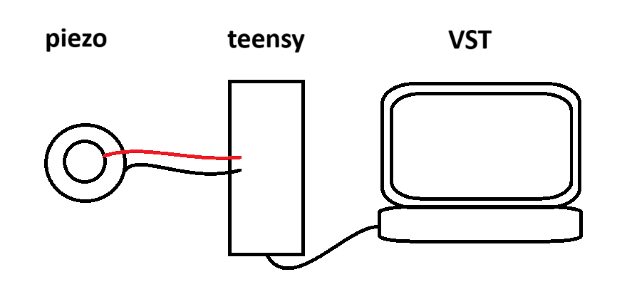

### + signal conditioning

With signal conditioning (from [Gadget Reboot](https://youtu.be/y2Lmbts9IIs)), initial settings became robust to some relatively janky conditions, including a free-hanging 35 mm piezo and a 6 ft 1/4" TS cable connected with alligator clips.


### + support structure

A support structure for 1/4" TRS ports allowed interfacing with proper ekit elements with more stability, as well as the addition of other elements like the 10k knob potentiometer.  While many of the drum elements will ultimately transport at least two signals (batter head + rimshot or edge + bell, for example), the current system is only set up to handle the batter head signal—hence the dangling yellow wires which connect to the vestigial ring of the TRS port.


### + foot controller support

Using the variable resistor in the Roland-esque hi-hat foot controller with a voltage divider allows communicating its plunger position as an analog signal mapped to MIDI CC#4 which controls the hi-hat closedness parameter in Kontakt Studio Drummer.


## Interfacing with the VST/DAW

The microcontroller sends USB MIDI and is recognized by software as "APK MIDI" (configured using the name.c file).  To minimize latency, I'm using a PreSonus Studio 68c audio interface with a sample buffer size at or below 256.  Testing the basic strikes yields latencies difficult to detect to my ears.

Note that foot controller CC seems to require matching port numbers in the Kontakt wrapper and the FL MIDI IO settings.

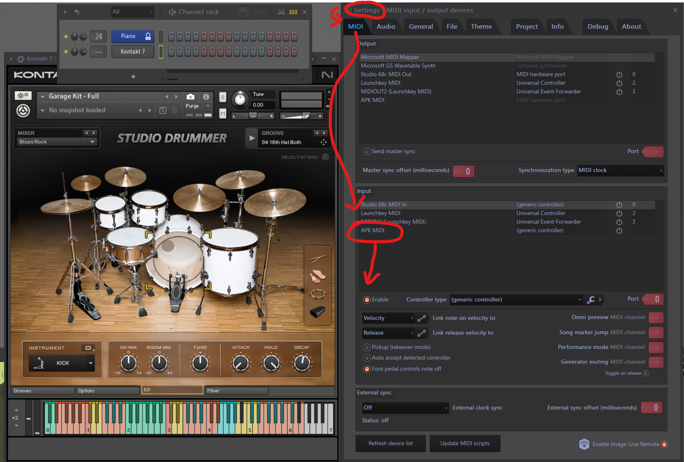
  
## Code Structure

### Dependencies

- USBHost_t36.h

- ADC.h

### controller state structs

The meat of the logic is in the trigger (MidiTrigger) and CC (ccControl) structs which contain fields for the state of each sensor as well as the methods to check and trigger the relevant MIDI:

```cpp
struct MidiTrigger {
  int analogPin;
  int midiNote;

  void checkAndTrigger() {
    int sensorValue = adc->analogRead(analogPin);

    // Monitor the peak value of the signal for triggering
    if (state == ch_idle) {
      if (sensorValue > (peakValue + detectionThreshold)) {
        state = ch_triggered;
        peakValue = sensorValue;
      } else if (sensorValue <= (peakValue - detectionThreshold)) {
        peakValue = sensorValue;
      }
    }

    // Monitor the rising edge of a triggered signal
    if (state == ch_triggered) {
      if (sensorValue > peakValue) {
        // Update peak value
        peakValue = sensorValue;
      } else if (sensorValue <= (peakValue - detectionThreshold)) {
        // Signal has settled; trigger the MIDI note
        float velocity = map(peakValue, 1, 1024, 30, 127);
        usbMIDI.sendNoteOn(midiNote, velocity, 1);
        usbMIDI.sendNoteOff(midiNote, 0, 1);
        noteActive = false;
        // Reset to idle state
        state = ch_idle;
        // Trail the peak lower now that it has settled
        peakValue = sensorValue;
      }
    }
  }
};
```

```cpp
struct ccControl {
  int analogPin;
  int ccNumber;
  int lastValue = -1;  // Initialize with an invalid value to force the first send
  bool isPedalDown = false;

  void checkAndSend() {
    int sensorValue = adc->analogRead(analogPin);
    int ccValue = map(sensorValue, 840, 5, 0, 127);  // Map to MIDI CC range
    if (ccValue - lastValue > 2 || ccValue - lastValue < -2) {  // Only send if value has changed
      usbMIDI.sendControlChange(ccNumber, ccValue, 1);
      lastValue = ccValue;

      // Check if the pedal has moved to the near-closed position rapidly
      if (ccValue > 120 && !isPedalDown) {  // Adjust threshold as needed
        // int pedalVelocity = map(lastValue - ccValue, 0, 7, 60, 127);
        usbMIDI.sendNoteOn(44, 110, 1); 
        usbMIDI.sendNoteOff(44, 0, 1);
        isPedalDown = true;
        // Serial.print("Pedal Down");
      }

      if (isPedalDown && ccValue <= 120){
        isPedalDown = false;
      }
    }
  }
};
```

### MidiTrigger Array

And then the sensors arrays,

```cpp
const byte numTriggers = 8;
noteTrigger triggers[] = {
  {A0, 46},
  {A1, 61},
  {A2, 62},
  {A3, 63},
  {A4, 64},
  {A5, 65},
  {A6, 66},
  {A7, 67},
};

const byte numCCs = 1;
ccControl ccControls[] = {
  {A8, 4},
};

```

are looped over to call the check method for each:

```cpp
void loop() {
  checkNotes();
  checkCC();
}

void checkNotes() {
  for (int i = 0; i < numTriggers; i++) {
    triggers[i].checkAndTrigger();
  }
}

void checkCC() {
  for (int i = 0; i < numCCs; i++) {
    ccControls[i].checkAndSend();
  }
```

## Usage

1. Upload the code to your microcontroller.
2. Connect the sensors to corresponding analog pins.
3. Enable the device in software

Debug with serial plotter to dial in the sensitivity of the sensors.

REMEMBER to adjust the length of the trigger array if you have more or fewer sensors.  Is this how C++ programmers really live?

Modify the name.c file in this repository to change the name of the MIDI device in your DAW

## To-do

- [x] implement a more robust peak detection algorithm that monitors the trend in the signal rise and decay
- [x] scale up sensors allowable sensors
- [x] get latency difficult to detect
- [ ] more debounce (currently upwards of 5 triggers for hard strikes)
- [ ] investigate loudness issues
  - [ ] try louder mapping (~59 max trigger value)
  - [ ] record values for soft/medium/hard hits across several controller to see if some are just less sensitive (knowing sensitivity variance will be necessary soon either way)
- [ ] polish continuously variable hi-hat implementation
  - [x] send foot pedal CC for the Lemon hi-hat compatible with Kontact Studio Drummer's hat-closedness parameter (CC#4)
    - [ ] get to work in FL's Kontakt instance out of the box (got it by coordinating ports in FL MIDI IO settings and the Kontakt wrapper...but idk how to hard code default midi controller port number and it resets on each upload it seems)
  - [x] get hat to recognize a pedal press and send the note (assigned a threshold and `isPressed?` boolean)
  - [ ] implement velocity sensitivity (circle buffer that calculates maximum difference when the signal crosses the pedal press threshold and maps that to a velocity range?)
  - [ ] narrow the closeness range to get true closed hat sound
  - [ ] solve bug where hat triggers don't cut currently playing samples like they should (possibly Kontakt isn't equipped to deal with the repeat signals from poor debounce so solving that might solve this?)
- [ ] implement rimshot piezos (may need special logic to reject a batterhead detection when it's simultaneous with a rimshot detection though current logic has been sufficient for the Alesis heads to reject batterhead sensing on a rimshot strike)
- [ ] Build toward high-end Roland-esque UI
  - [x] wire knob pot
  - [ ] implement digital QoL like MIDI note selection hot swap and sensitivity adjustment
- [ ] extend to triggering local samples on an SD card and pair with i2s audio output
- [ ] dial in sensitivities with the trim pots
- [ ] test with a cheap controller with serial support and MIDI libraries (e.g., knock-off arduino micro ~3/$20) to see if this could be made more affordably

## Resources

### MIDI Percussion Note Numbers

- **36 - Kick**
- 37 - Snare Cross Stick
- **38 - Snare**
- 41 - Tom (floor 2)
- 42 - Hi-Hat (closed) (*sent through CC struct*)
- 45 - Tom (low)
- 43 - Tom (floor 1)
- 44 - Hi-Hat (pedal) (*sent through CC struct*)
- 45 - Tom (low)
- 46 - **Hi-Hat (open)**
- 47 - Tom (mid)
- 48 - Tom (high)
- 49 - **Crash**
- 51 - **Ride (edge)**
- 52 - China
- 53 - Ride (bell)
- 55 - Splash

### Links

- [Teensy 4.1 Pinout Diagram](https://www.pjrc.com/teensy/pinout.html) - for reference

- [Gadget Reboot Youtube Video](https://youtu.be/y2Lmbts9IIs) - initial codebase for i2s implementation, circuit design for signal conditioning

- [Lemon brand cymbals I used](https://www.alibaba.com/product-detail/Lemon-electronic-drum-cymbals-bundle-A_1600389746562.html) - Knock-off Roland cymbals (careful, the shipping takes several weeks and costs as much as the cymbals...still works out to much less than Roland but also worth considering just buying the full Lemon kit if you can pay the tariffs)
  
- [Evan Kale MIDI Drums Github](https://github.com/evankale/ArduinoMidiDrums) - Rockband kit midi hijacking ideas (RIP EK)

## Mockups, schematics, and prototype progress

### Signal conditioning considerations

Gadget Reboot (GR) lays out the signal conditioning steps in his video, and I've enumerated and roughly illustrated here.  Note that GR's system is a bare piezo tapped with a stiff mechanical pencil and, as such, the considerations and measurements he presented will likely differ substantially from all of the systems I have in mind (salvaged Rock Band kit, modified acoustic shells, and existing ekit components).

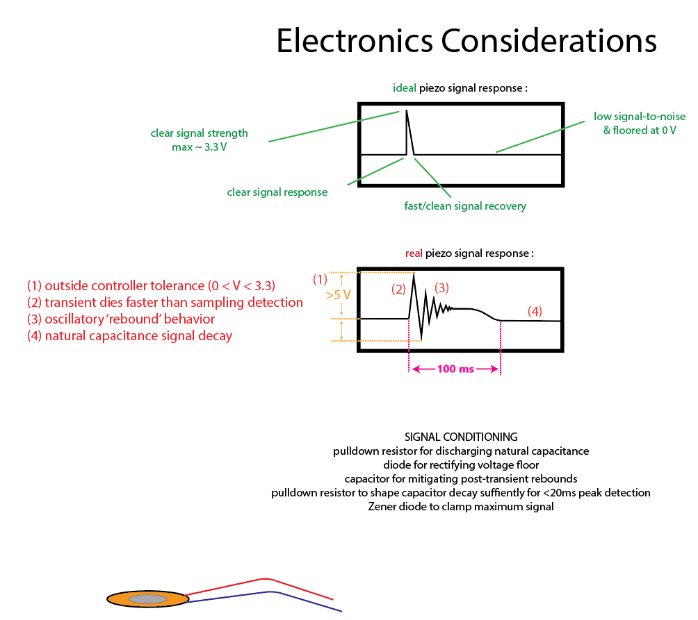

Feel free to [skip to some real oscilloscope results](#signal-conditioning-evaluation) below.

### Thoughts on physics of the strike impulse

Because of GR's barebones approach, none of the relevant physics considerations can really be extracted from his video.  I've searched somewhat thoroughly for various DIY ekit builds that comment on fundamental physical considerations, but this seems to be the most neglected aspect as creators generally opt to outsource the shell, mesh head, and trigger components.  

At time of writing, I can agree that the shells and mesh heads are, while expensive, critical to the feel of the kit.  The triggers are, of course, critical to the response of the kit, but perhaps the thrust of this project is best understood through the view of DIY triggering as a viable cut into the bulk of the cost of a high-end ekit, as well as a source of otherwise unattainable customization.

Perhaps publically available patents from Roland, Yamaha, and Alesis could provide additional insight into physics, materials, and structure in optimizing signal response, but a cursory search has been unhelpful in most meaningful ways.  That said, following two images detail some of my half-baked thoughts on the most likely problems and solutions in the physics of the the ekit strike impulse through the sensor and shell.

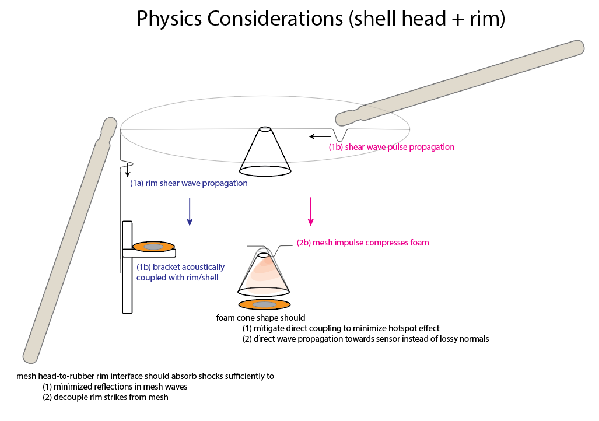

### Shell construction

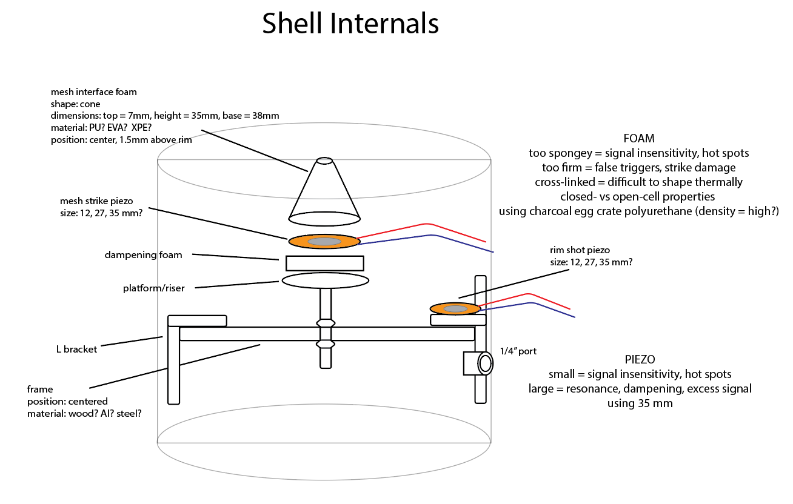

### Thoughts on hijacking a Rockband drum kit to wire to the microcontroller

Perhaps the most interesting and affordable possible starting point for a full set of triggers, pads, and structure is to open a video game (e.g., rockband, guitar hero) drum kit's body and simply route the pads signals to the microcontroller instead of the existing circuit board (a la Evan Kale).  Certainly the existing board must include its own conditioning and processing and it would be all the more attractive to simply hijack that, but I don't have the expertise to reverse engineer the board and I therefore anticipate it would not be worth the effort.

And so, the following image illustrates a basic overview of of implementing the GR conditioning circuit on the Rockband drum pads.

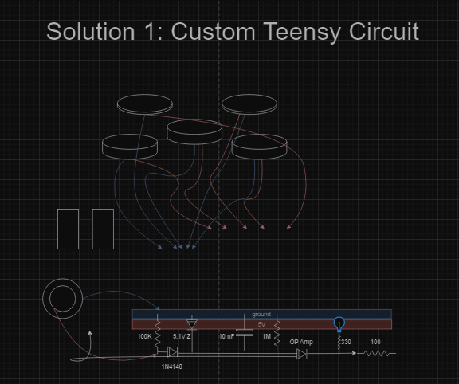

### Proto-board circuit layout

Regardless of whether the Rockband kit, acoustic kit, or e-kit components are used, some form of the GR conditioning circuit will be necessary.  While the previous image illustrated a basic overview of how this would apply to a single input, fitting the circuit compactly onto a board (which, in turn, ideally fits into a small box) leaves little room for improvisation.  The following image illustrates the detailed proto-board layout for the input, conditioning, processing, digital-analog conversion, and output.

Note that, ultimately, the complexity of creating and troubleshooting the proto-board form of this project was so overwhelming that I opted to purchase the board through GR's PCBway affiliate link (letting them include and solder all the parts except for the trim pots, which seemed overpriced in their quote).  Nonetheless, I feel the diagram can be helpful as a reference going forward and **not** just because I wasted so much time on it and am upset.

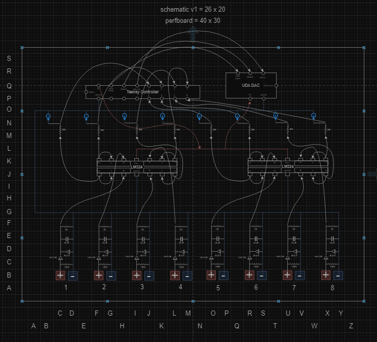

### Thoughts on using an existing ekit module

Here, I simply illustrate the relevant cables/ports that would connect an existing ekit to the microcontroller.

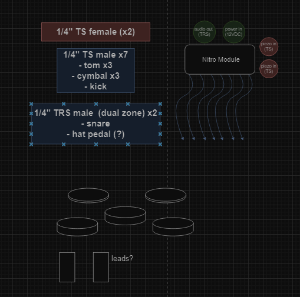

### Thoughts on printing a box for the circuit

The following images illustrate the design of a 3D-printed box to house the circuit.  This type of practical design is something I'm thoroughly unfamiliar with, but I've attempted to enumerate the desired traits and and solutions in this figure.  

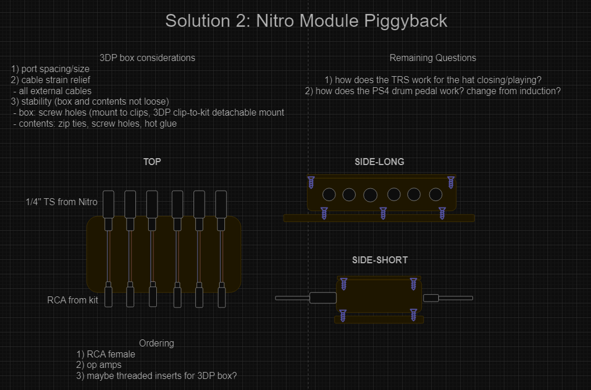

### 3DP Box Design prototype

I've designed a box in Blender to house the circuit (and included a .blend file in this repository, though it is not designed to be user-friendly).  The box is designed to be printed in several parts and to fit together with dovetail-like joints.  The top of the box is designed to be removable for easy access to the circuit.  There are holes in the front for the TS jacks and in the back for the usb, power, and audio connectors.  A QR code is stamped onto the lid linking to my github.io homepage.

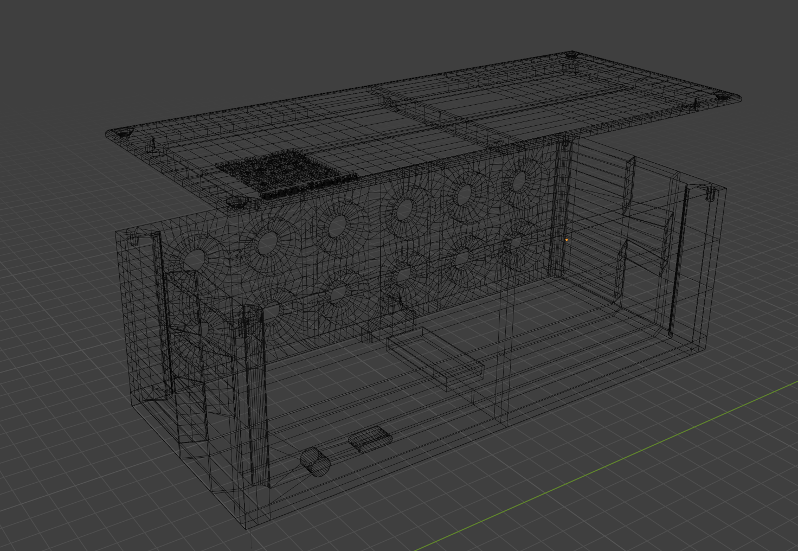

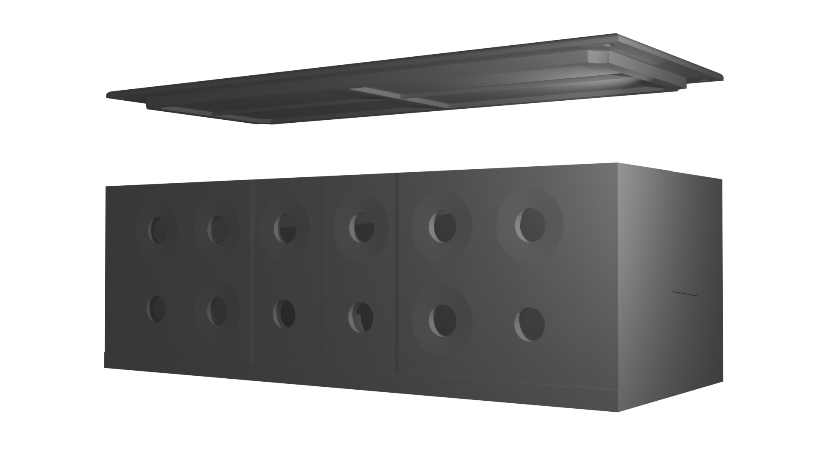

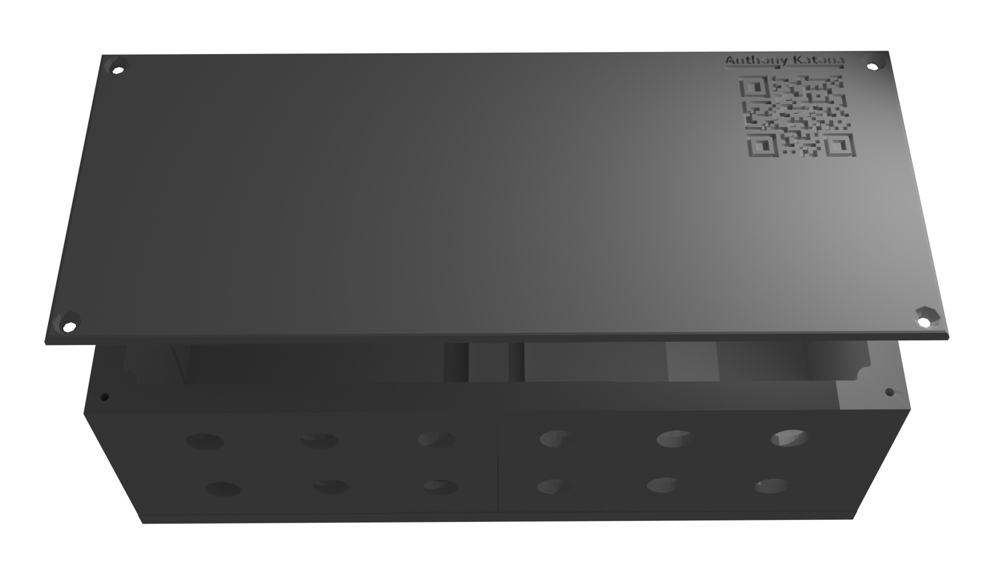

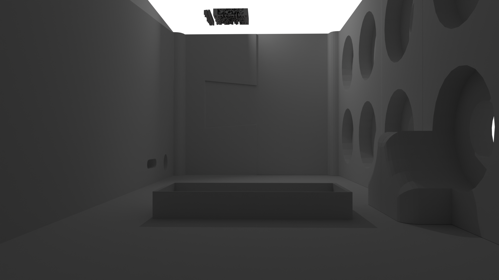

Future plans include a way to mount the box to a drum rack in a way that is both secure and adjustable (possibly a clamp system that can be tightened with a wing nut like the Alesis module?) as well as additional ports for dials, switches, and LEDs that can be interacted with from the outside of the box.

### Printed prototype v0.1

The SLA printed box body prints in 4 parts: front-left corner, front-right corner, back-left corner-and-floor, and back-right corner-and-floor.  A lid and small stand (for storing layers of boards if necessary) are included as well.

Good:
It is surprisingly sturdy and the dovetails fit together imperfectly, but securely.  The front 1/4" ports are spaced nicely and interface well with the jacks, and the box is spacious enough to fit the circuit.  The small stand fits snugly in the box and is easy to remove.

Bad:
On the other hand, I was overly optimistic about the wall dovetails providing enough stability to keep the left and right floor-halves and front-halves together, and so there is some noticeably unnattractive, (though perhaps not *totally* functionally disruptive) misalignment and wobbling.  I'd rather keep the design somewhat modular so that individual breaks can be replaced, but some sort of internal support may be necessary to keep the structure more uniformly stable.

Similarly, there is warping in many parts, particularly the thin walls of the platform and lid.  This is certainly exacerbating any misfitting/misalignment, but it's likely something I'll be able to correct with more experience with SLA printing (and likely less of an issue with FDM).  the solid print makes the box a bit heavier than I'd like, though I mostly wanted the prototypes to be stable before I optimized weight and material use.  Finally, while QR code on the lid is legible to the eye, the lighting conditions strongly affect its recognizability with my iPhone 12, favoring harsh, sidelit conditions.

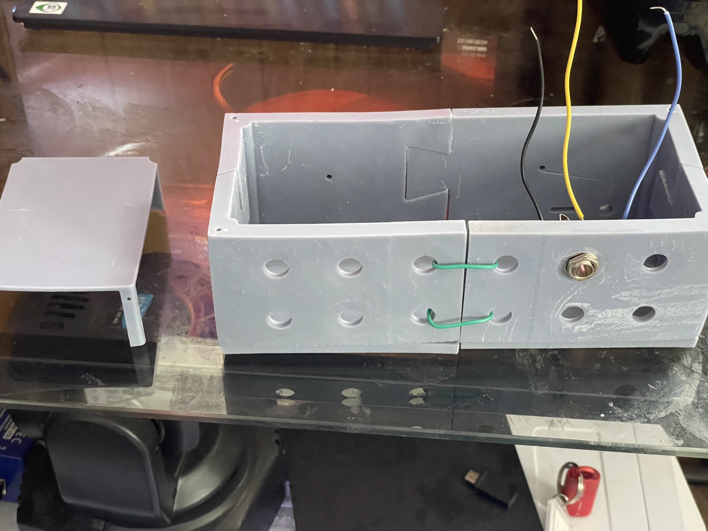

### Signal conditioning evaluation

Measurements made from the GR video thoughts as enumerated in [electronics section](#signal-conditioning-considerations)


I've taken more measurements but working them up takes a lot of time, though I could probably also just upload the oscilloscope image exports with a reasonable naming scheme with comparable utility.  However, I'd really like to make some kind of graph to show how these metrics are influenced by not only the conditioning, but the materials and construction of the sensor and shell.

## License

This project is licensed under the MIT License
